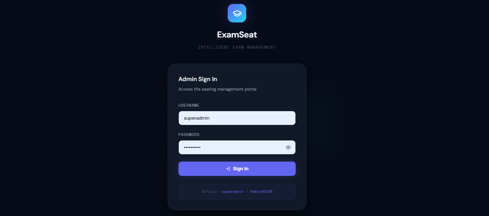
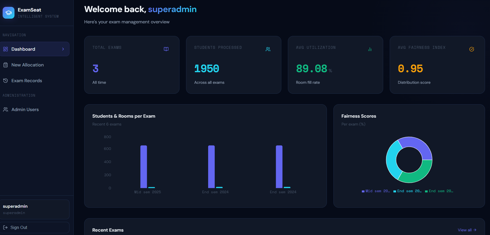
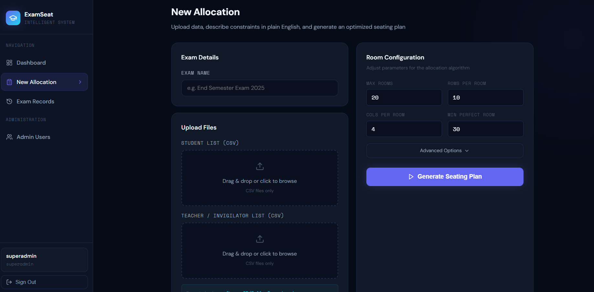
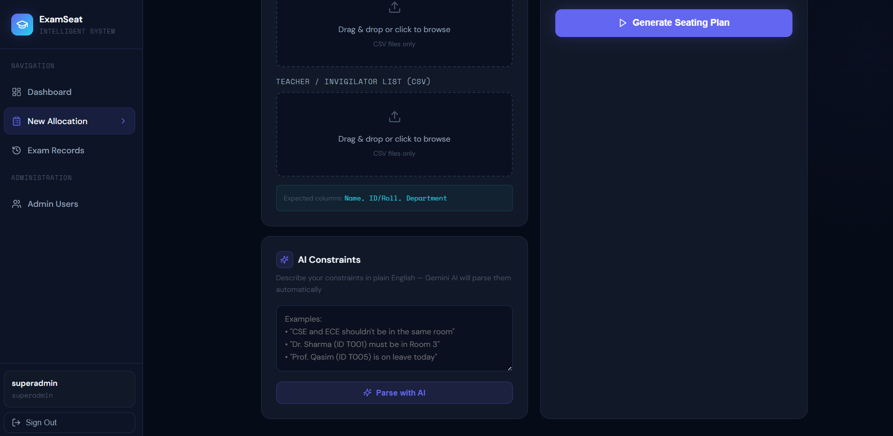

# ExamSeat — Intelligent Exam Seating Arrangement System


> A full-stack web application that automates exam seating arrangements and invigilator assignments using intelligent constraint-based algorithms and AI-powered natural language processing.

---

## Overview

ExamSeat eliminates the manual, error-prone process of exam hall management. It takes student and teacher data as CSV inputs, applies a multi-phase greedy seating algorithm with fairness constraints, assigns invigilators while preventing departmental conflicts, and generates printer-ready Excel reports — all through a modern, role-protected web interface.

The system integrates **Google Gemini AI** to allow administrators to describe seating constraints in plain English (e.g. *"CSE and ECE shouldn't share a room"*), which are automatically parsed into structured rules and applied to the allocation engine.


## Screenshots

| Login | Dashboard |
|-------|-----------|
|  |  |

| New Allocation | AI Constraints |
|----------------|----------------|
|  |  |

---

## Features

- **3-Phase Seating Algorithm** — alternating `[A, B, A, B, ...]` column layout across any room size, with greedy pair selection and leftover optimization
- **AI Constraint Parsing** — natural language constraints translated to structured rules via Gemini 2.5 Flash
- **Invigilator Assignment** — load-balanced, double-booking-safe, same-department conflict prevention
- **JWT Authentication** — role-based access control (`superadmin` / `admin`)
- **Admin Management** — create and remove admin users (superadmin only)
- **Exam Records** — full history of past allocations with re-downloadable Excel reports
- **Live Metrics Dashboard** — room utilization, fairness index, load variance, conflict count with charts
- **Excel Export** — color-coded, formatted, printer-ready seating charts via OpenPyXL
- **Graceful AI Fallback** — system works fully without a Gemini API key; AI section is disabled cleanly

---

## Tech Stack

| Layer | Technology |
|-------|------------|
| Frontend | React 18 + Vite + Recharts |
| Backend | Flask 3 + Flask-JWT-Extended |
| Database | SQLite via SQLAlchemy |
| AI Integration | Google Gemini 2.5 Flash (`google-genai`) |
| Auth | JSON Web Tokens (JWT) |
| Output | OpenPyXL (Excel `.xlsx`) |
| Styling | Custom CSS design system (dark theme) |

---

## Project Structure

```
exam-seating-system/
│
├── backend/
│   ├── app.py              # Flask app — all API routes + Gemini integration
│   ├── algorithm.py        # Core seating + invigilator algorithm
│   ├── requirements.txt    # Python dependencies
│   ├── .env.example        # Environment variable template
│   └── start.sh            # One-click start script (macOS/Linux)
│
├── frontend/
│   ├── index.html
│   ├── package.json
│   ├── vite.config.js
│   └── src/
│       ├── App.jsx             # Router + protected routes
│       ├── api.js              # Axios client with JWT interceptors
│       ├── index.css           # Global design system + CSS variables
│       ├── context/
│       │   └── AuthContext.jsx
│       ├── components/
│       │   ├── Layout.jsx       # Sidebar navigation layout
│       │   └── MetricCard.jsx   # Reusable metric display card
│       └── pages/
│           ├── Login.jsx        # Animated login page
│           ├── Dashboard.jsx    # Stats overview + charts
│           ├── Allocate.jsx     # Upload → AI constraints → Generate → Download
│           ├── Records.jsx      # Past exam record management
│           └── AdminManage.jsx  # Admin user CRUD (superadmin only)
│
├── sample_data/
│   ├── students_sample.csv  # Sample student data for testing
│   └── teachers_sample.csv  # Sample teacher data for testing
│
└── README.md
```

---

## Quick Start

### Prerequisites

- Python 3.9+
- Node.js 18+
- npm

### 1. Clone the repository

```bash
git clone https://github.com/YOUR_USERNAME/exam-seating-system.git
cd exam-seating-system
```

### 2. Backend Setup

```bash
cd backend

# Create and activate virtual environment
python -m venv venv

# Windows
venv\Scripts\activate
# macOS/Linux
source venv/bin/activate

# Install dependencies
pip install -r requirements.txt

# Configure environment
cp .env.example .env
# Edit .env and add your GEMINI_API_KEY (optional — see below)

# Start Flask server
python app.py
```

Backend runs on → **http://localhost:5000**

On first run, a default superadmin account is created automatically:
```
Username: superadmin
Password: Admin@1234
```

> ⚠️ Change this password after first login in production.

### 3. Frontend Setup

Open a new terminal:

```bash
cd frontend
npm install
npm run dev
```

Frontend runs on → **http://localhost:5173**

---

## AI Constraints (Optional)

ExamSeat uses **Google Gemini 2.5 Flash** to parse natural language constraints into structured allocation rules.

### Setup

1. Get a free API key at [https://aistudio.google.com/apikey](https://aistudio.google.com/apikey)
2. Add it to `backend/.env`:

```env
GEMINI_API_KEY=your_api_key_here
```

### Without an API Key

The system works **fully without a Gemini key**. All seating allocation, authentication, records, and Excel export features work normally. Only the AI constraint parsing feature will be disabled — a clear warning is shown in the UI.

### Example Constraints

Type something like this in the AI Constraints box:

```
CSE and ECE shouldn't be in the same room.
Dr. Sharma (ID T001) must be in Room 3.
Prof. Qasim (ID T005) is on leave today.
```

This is automatically parsed into:

```json
{
  "forbidden_dept_pairs": [["CSE", "ECE"]],
  "fixed_invigilators": [{"TeacherID": "T001", "Room": 3}],
  "unavailable_teachers": ["T005"]
}
```

---

## CSV Format

### Students CSV

```csv
StudentID,Name,Department
2262044,John Smith,CSE-DS
2262045,Jane Doe,ECE
2262046,Alex Roy,ME
```

| Column | Accepted Names |
|--------|---------------|
| Student ID | `StudentID`, `ID`, `Roll`, `RollNo` |
| Name | `Name`, `StudentName`, `FullName` |
| Department | `Department`, `Dept` |

### Teachers CSV

```csv
TeacherID,Name,Department
T001,Prof. A Sharma,CSE-DS
T002,Prof. B Das,ECE
T003,Prof. C Roy,ME
```

| Column | Accepted Names |
|--------|---------------|
| Teacher ID | `TeacherID`, `ID`, `Tid` |
| Name | `Name`, `TeacherName`, `FullName` |
| Department | `Department`, `Dept` |

> Sample CSV files are provided in the `sample_data/` folder for testing.

---

## Algorithm

### Seating — 3 Phases

| Phase | Strategy | Min Fill |
|-------|----------|----------|
| Phase 1 — Perfect | Alternating `[A,B,A,B,...]` across all columns, greedy best-pair | Configurable (default 30) |
| Phase 2 — Good | Same pattern, relaxed threshold | Configurable (default 20) |
| Phase 3 — Leftover | Columnar fill from largest remaining departments | Any |

The alternating column pattern works dynamically for **any number of columns** — odd-indexed columns go to Dept A, even-indexed to Dept B — ensuring no permanently empty columns regardless of room configuration.

### Invigilator Assignment

- Greedy load balancing via duty counter
- **Double-booking prevention** — each teacher assigned to at most one room per exam
- Same-department conflict avoidance
- AI fixed assignments applied first, then remaining slots filled greedily
- Unavailable teachers fully excluded from pool
- Graceful fallback: relaxes dept constraint before assigning N/A

### Metrics

| Metric | Description |
|--------|-------------|
| Room Utilization | `filled seats / total seats × 100` |
| Fairness Index | `1 - (variance / max_variance)` across dept counts, clamped [0,1] |
| Load Variance | Standard deviation of invigilator duty counts |
| Conflict Count | Same-dept invigilator assignments (target: 0) |

---

## API Reference

| Method | Endpoint | Auth | Description |
|--------|----------|------|-------------|
| `POST` | `/api/auth/login` | ❌ | Login, receive JWT token |
| `GET` | `/api/auth/me` | ✅ | Get current admin profile |
| `POST` | `/api/constraints/parse` | ✅ | Parse natural language via Gemini AI |
| `POST` | `/api/allocate` | ✅ | Run allocation, save record |
| `GET` | `/api/allocate/:id/download` | ✅ | Download Excel report |
| `GET` | `/api/records` | ✅ | List all exam records |
| `GET` | `/api/records/:id` | ✅ | Get single record details |
| `DELETE` | `/api/records/:id` | ✅ | Delete a record |
| `GET` | `/api/dashboard/stats` | ✅ | Aggregated dashboard statistics |
| `GET` | `/api/admins` | ✅ | List all admin users |
| `POST` | `/api/admins` | ✅ Superadmin | Create new admin |
| `DELETE` | `/api/admins/:id` | ✅ Superadmin | Remove an admin |

All protected endpoints require `Authorization: Bearer <token>` header.

---

## Auth & Roles

| Role | Capabilities |
|------|-------------|
| `superadmin` | Full access — manage admins, view/delete all records |
| `admin` | Generate plans, view/download/delete own records |

JWT tokens expire after **8 hours**.

---

## Deployment

For production deployment:

| Service | Purpose |
|---------|---------|
| [Render](https://render.com) / [Railway](https://railway.app) | Flask backend |
| [Vercel](https://vercel.com) / [Netlify](https://netlify.app) | React frontend |
| PostgreSQL | Replace SQLite for production database |

Set `GEMINI_API_KEY` as an environment variable in your hosting platform dashboard — never commit secrets to the repository.

---

## License

This project is for academic purposes. All rights reserved.
